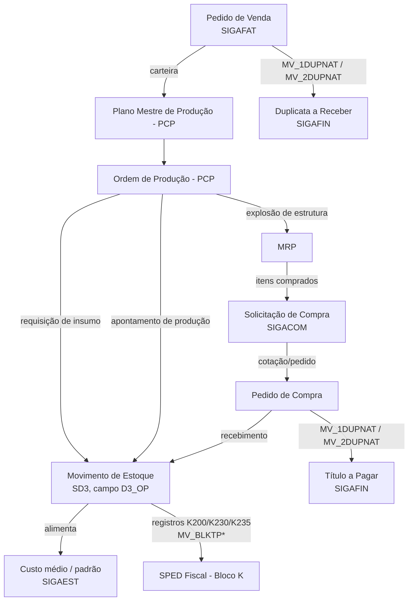

# Fluxo: PCP → Estoque/Custos → Compras → Fiscal (Bloco K)

Este documento consolida, num único fluxo navegável, o que hoje está
espalhado entre o TDN, a Central de Atendimento TOTVS e artigos de
consultoria (ver [`fontes.md`](fontes.md)). O objetivo é mostrar **como um
apontamento de produção se propaga pelo sistema**, não apenas o que cada
parâmetro faz isoladamente.

## Visão geral

## Passo a passo

1. **Plano Mestre de Produção (PCP)** é alimentado pela carteira de pedidos
   de Vendas (SIGAFAT). Isso conecta demanda comercial à programação da
   fábrica.
2. **Ordem de Produção (OP)** gera dois tipos de evento no Estoque: a
   requisição de insumos e o apontamento de produção. Ambos criam
   movimentos internos na tabela `SD3`, sempre carregando a OP de origem no
   campo `D3_OP`. É esse vínculo que permite calcular o custo médio/padrão
   do item produzido a partir do que foi efetivamente consumido e apontado.
3. **MRP** explode a estrutura do produto (BOM) e, para os itens que não são
   fabricados (comprados), gera **Solicitação de Compra** automaticamente —
   é o gatilho que liga PCP a Compras sem intervenção manual.
4. **Compras** transforma a solicitação em cotação e Pedido de Compra; ao
   ser faturado pelo fornecedor, o recebimento gera novo movimento de
   estoque e, no Financeiro, um título a pagar cuja natureza é definida
   pelos parâmetros `MV_1DUPNAT`/`MV_2DUPNAT` (ver
   [`parametros-integracao-mv.md`](parametros-integracao-mv.md)).
5. **Fiscal (Bloco K)**: os mesmos movimentos de estoque/produção que
   alimentam o custo também alimentam os registros obrigatórios do SPED
   Fiscal — `K200` (estoque escriturado), `K230` (produção) e `K235`
   (insumos consumidos) — controlados por tipo de produto via a família de
   parâmetros `MV_BLKTP*`. Essa obrigação é mensal e vale para indústrias e
   equiparadas.
6. **Vendas → Financeiro**: em paralelo, o Pedido de Venda gera a duplicata
   a receber, também via `MV_1DUPNAT`/`MV_2DUPNAT`, fechando o ciclo
   comercial.

## O que falta validar

- Confirmar em ambiente de teste se o campo `D3_OP` é preenchido em 100% dos
  cenários de requisição/devolução ou só nos padrões (marcado como ⚠️ nos
  itens correlatos em `parametros-integracao-mv.md`).
- Mapear o ponto exato em que `MV_QIPEST`/`MV_QIPOPEP` (Qualidade) entram
  nesse fluxo quando a empresa usa inspeção de processo antes do
  apontamento.
- Detalhar o fluxo de aprovação/alçada (`MV_JALCADA`, `MV_FINCTAL`) que pode
  interromper a geração automática do título a pagar.

## Como este fluxo foi montado

A partir de fontes oficiais (TDN/Central de Atendimento TOTVS) combinadas
com o relato de fluxo publicado pela consultoria Triade Intelligence sobre
PCP — usado aqui apenas como ponto de partida factual, revalidado contra
fonte oficial onde possível. Lista completa em [`fontes.md`](fontes.md).
